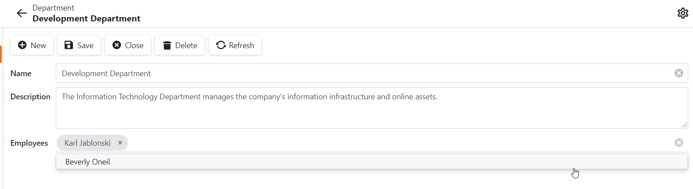

# XAF Blazor - How to use a TagBox to view and edit a collection property in Detail Views

## Scenario

There are a couple of child records, and it is required to display all available records in a compact manner, and link and unlink them from the master object quickly (for example, with check boxes or tokens/tags). When an item is selected, this means that this record is associated with the master object.

## Solution

We created a custom XAF Property Editor based on our [DxTagBox](https://docs.devexpress.com/Blazor/DevExpress.Blazor.DxTagBox-2) component. For more information, review the following concepts:
- [Property Editors](https://docs.devexpress.com/eXpressAppFramework/113097/concepts/ui-construction/view-items/property-editors);
- [How to: Implement a Property Editor Based on a Custom Component (Blazor)](https://docs.devexpress.com/eXpressAppFramework/402189/task-based-help/property-editors/how-to-implement-a-property-editor-based-on-custom-components-blazor?p=netstandard);
- [Application Solution Components](https://docs.devexpress.com/eXpressAppFramework/112569/concepts/application-solution-components).

To simplify this task, we used our built-in Component Model (DxTagBoxModel), Component Adapter (DxTagBoxAdapter), and Component Renderer (DxTagBoxRenderer).

## Implementation Steps

Create a **BlazorPropertyEditorBase** class descendant and follow the steps listed below:

**Step 1.** Apply [PropertyEditorAttribute](https://docs.devexpress.com/eXpressAppFramework/DevExpress.ExpressApp.Editors.PropertyEditorAttribute.-ctor(System.Type-System.String-System.Boolean)) to the editor and set the first attribute parameter to **IList** and the **isDefaultEditor** parameter to **false**. With these values, you can choose this Property Editor for a collection in the **Model Editor** , and this editor will not be marked as default.

**Step 2.** Override the **CreateComponentAdapter** method. In this method, create a component model, create a DataItem<string> collection, populate it with object handles using the [IObjectSpace.GetObjectHandle](https://docs.devexpress.com/eXpressAppFramework/DevExpress.ExpressApp.IObjectSpace.GetObjectHandle%28System.Object%29) method, and then assign this collection to the component model's ***Data*** property. Then, specify the component model's ***ValueFieldName*** and ***TextFieldName*** properties. They are used to bind the ***DxTagBox*** component.

**Step 3.** Override the **ReadValueCore** method. This method is required to obtain a collection of values from a PropertyValue, loop through this collection, and update your component model's data.

**Step 4.** Override the **WriteValueCore** method. Use this method to obtain data from the component model and then update the collection stored in the ***PropertyValue*** property.

**Step 5.** Return **false** in the overridden **IsMemberSetterRequired** method to specify that the editor should not be read-only.

**Step 6.** Optional. You may wish to slightly customize the Detail View layout for better appearance by following recommendations described at [Detail View Layout Customization](https://docs.devexpress.com/eXpressAppFramework/112817/ui-construction/views/layout/view-items-layout-customization).

<!-- default file list -->  
*Files to look at*: 

* [TagBoxPropertyEditor.cs](./TagBoxPropertyEditorSample.Module.Blazor/Editors/TagBoxPropertyEditor.cs)
<!-- default file list end -->
  
***See also:***  
[How to represent a collection property using a checked list box](https://supportcenter.devexpress.com/ticket/details/e1807)
